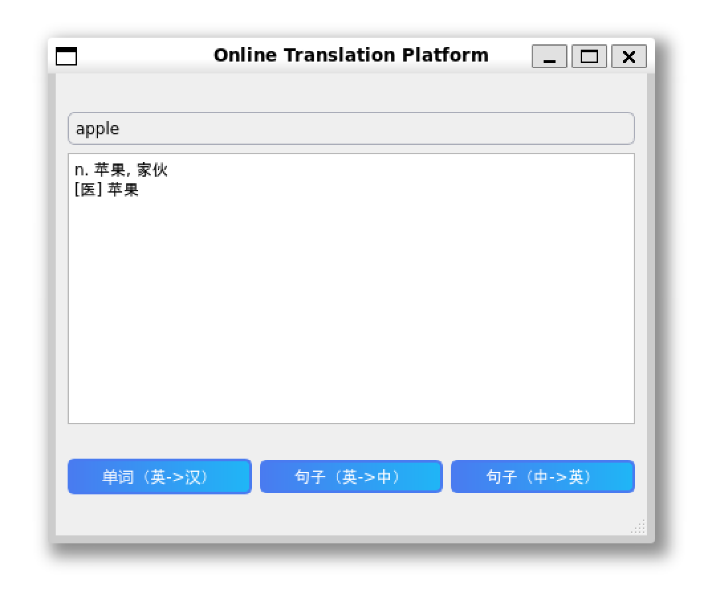
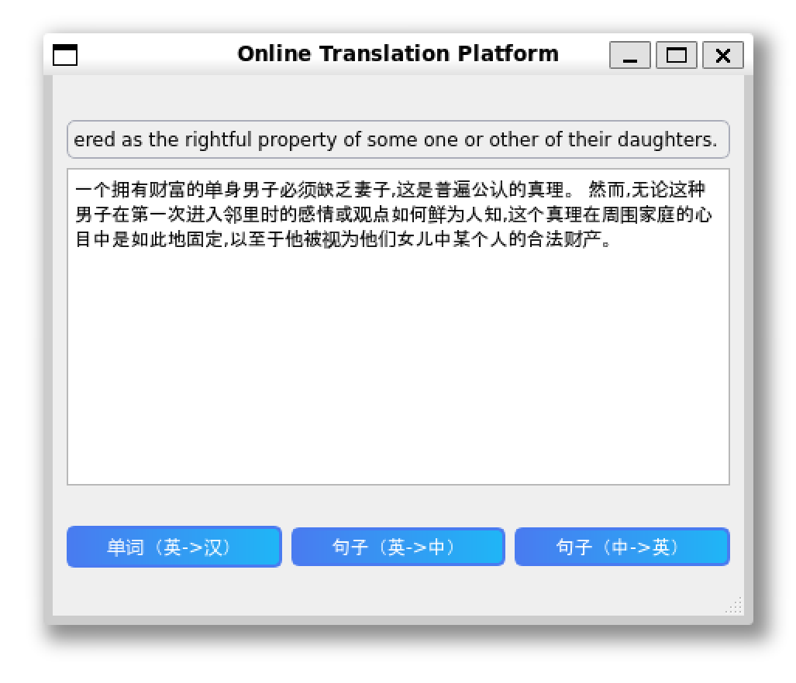
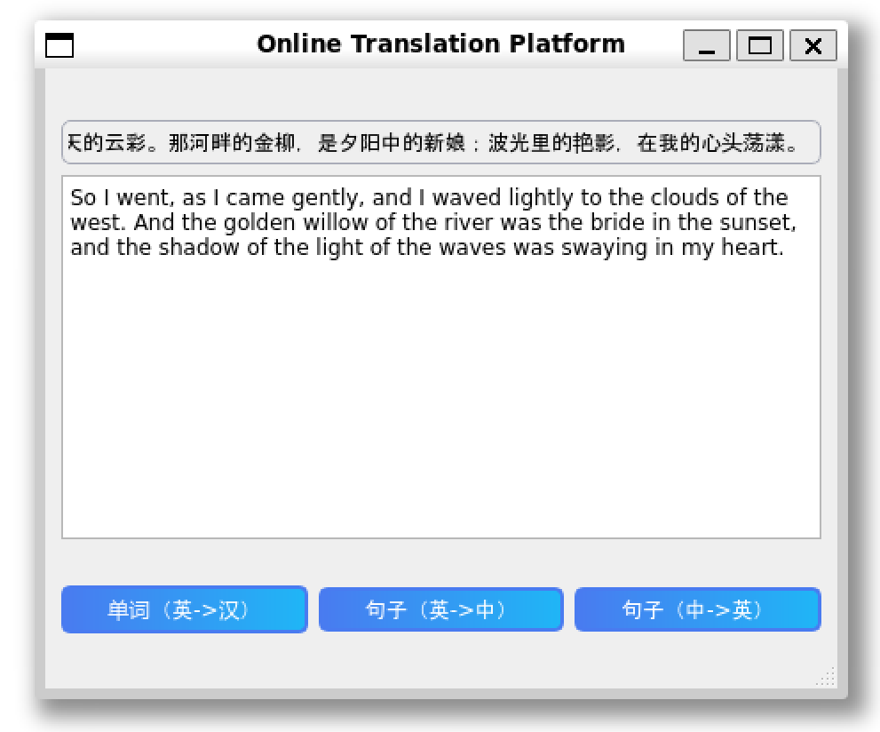

# 在线在线翻译平台
本文件由本项目翻译[README.md](README.md)得到，结果可能不准确。

**这个项目只在Linux进行测试和执行,对其他操作系统没有保证。**
# 导言 导言 导言 导言 导言 导言 导言 导言
这是一个翻译平台, 您可以在此查找英文文字, 并双向翻译英文和中文。




# 授权地功能的信用
词典特征由[Linwei](https://github.com/skywind3000)由[ECDICT](https://github.com/skywind3000/ECDICT)驱动。

翻译特征由[赫尔辛基大学语言技术研究小组](https://huggingface.co/Helsinki-NLP)由[opus-mt-en-zh](https://huggingface.co/Helsinki-NLP/opus-mt-en-zh)和[opus-mt-zh-en](https://huggingface.co/Helsinki-NLP/opus-mt-zh-en)驱动。

# 设置设置设置设置设置设置设置
1. 安装 `Qt 创造者`( 建议 Qt 创造者 6.0.2 )。
2. 克隆此仓库。

## 服务器配置

1. [下载](https://github.com/skywind3000/ECDICT/releases/tag/1.0.28)所需的数据库 `ecdict-sqlite-28.zip` 并提取 `stardict.db` 进入`ServerTranslation`文件夹。

2. 在 `Qt 创造者` 中打开`ServerTranslation/ServerTranslation.pro`,如果一切顺利,你可以建造和运行这个项目。

**请注意服务器在“ 8082” 端口监听。 因此, 此端口不应被占用 。**

3. (**翻译用量**)在下面的链接安装`Pytorch`:
https://pytorch.org/get-started/locally/

4. (**翻译用量**)安装 `transformers` 和 `sentencepiece` Python 库
```shell
pip install transformers sentencepiece
```

5. (可选) 在运行此工程之前, 遵循 python 代码运行
```shell
python3 trans.py en "Hello, World!" # 产出应 "你好,世界!"
```
以及
```shell
python3 trans.py zh "你好，世界！" # 产出应 "Hello, world!"
```
下载和设置翻译模型。

## 客户配置
1. 在 `Qt 创造者` 中 打开 `OnlineTranslation/OnlineTranslation.pro`。
2. 打开`OnlineTranslation/mainwindow.cpp` 并更改变量`const QString ip` 到服务器的 IP 地址。
3. 如果一切顺利,你可以建造和运行这个项目。

# 用法

用户界面既简单又直观。
